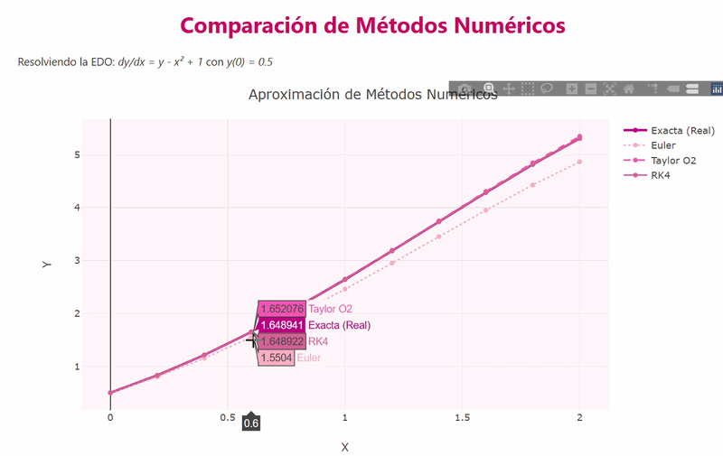

# Tema 6: Solución de Ecuaciones Diferenciales

##  Concepto General
Las ecuaciones diferenciales ordinarias (EDO) relacionan una función desconocida con sus derivadas. Dado que muchas de estas ecuaciones no tienen una solución analítica sencilla, utilizamos métodos numéricos para aproximar la trayectoria de la solución partiendo de una condición inicial. Esto se conoce como Problema de Valor Inicial (PVI).

---

## 1. Método de Euler
**Concepto:** Es el método más simple para resolver EDOs. Utiliza la pendiente de la recta tangente en el punto actual para "dar un paso" y predecir el siguiente valor de la función.

* **Fórmula:** $y_{i+1} = y_i + f(x_i, y_i)h$
* **Algoritmo:**
    1. Establecer la condición inicial $(x_0, y_0)$.
    2. Calcular la pendiente $f(x, y)$ en el punto actual.
    3. Multiplicar la pendiente por el tamaño del paso $h$ y sumarlo a $y$.
    4. Avanzar $x$ y repetir el proceso n veces.
* **Pseudocódigo:**
    ```text
    INICIO Euler(f, x0, y0, h, pasos)
      x <- x0
      y <- y0
      PARA i desde 0 HASTA pasos HACER
        MOSTRAR x, y
        y <- y + h * f(x, y)
        x <- x + h
      FIN PARA
    FIN
    ```
*  **[Ver Código: Euler](Codigos/Euler.py)**

---

## 2. Método de Taylor (2do Orden)
**Concepto:** Es una extensión del método de Euler que busca mayor precisión al incluir términos de mayor orden de la serie de Taylor (usando la segunda derivada), lo que reduce el error de truncamiento local.

* **Fórmula:** $y_{i+1} = y_i + h f(x_i, y_i) + \frac{h^2}{2} f'(x_i, y_i)$
* **Algoritmo:**
    1. Definir la función de la primera y segunda derivada.
    2. Calcular el incremento sumando el aporte de ambas derivadas.
    3. Actualizar los valores de $x$ y $y$.
* **Pseudocódigo:**
    ```text
    INICIO Taylor2doOrden(f, df, x0, y0, h, pasos)
      x <- x0
      y <- y0
      PARA i desde 0 HASTA pasos HACER
        y <- y + h * f(x, y) + (h^2 / 2) * df(x, y)
        x <- x + h
      FIN PARA
    FIN
    ```
*  **[Ver Código: Taylor](Codigos/Taylor.py)**

---

## 3. Método de Runge-Kutta (4to Orden)
**Concepto:** Es uno de los métodos más utilizados por su alta precisión. En lugar de usar una sola pendiente, calcula cuatro pendientes intermedias ($k_1, k_2, k_3, k_4$) dentro de cada paso para obtener un promedio mucho más exacto.

* **Fórmula:** $y_{i+1} = y_i + \frac{1}{6}(k_1 + 2k_2 + 2k_3 + k_4)$
* **Algoritmo:**
    1. Calcular $k_1$ en el inicio del intervalo.
    2. Calcular $k_2$ y $k_3$ en los puntos medios.
    3. Calcular $k_4$ al final del intervalo.
    4. Combinar las pendientes con pesos específicos para actualizar $y$.
* **Pseudocódigo:**
    ```text
    INICIO RungeKutta4(f, x0, y0, h, pasos)
      x <- x0, y <- y0
      PARA i desde 0 HASTA pasos HACER
        k1 <- h * f(x, y)
        k2 <- h * f(x + h/2, y + k1/2)
        k3 <- h * f(x + h/2, y + k2/2)
        k4 <- h * f(x + h, y + k3)
        y <- y + (k1 + 2*k2 + 2*k3 + k4) / 6
        x <- x + h
      FIN PARA
    FIN
    ```
*  **[Ver Código: Runge-Kutta](Codigos/Runge.py)**

###  Visualización en Movimiento de la comparación

Aquí puedes ver una demostración de cómo los tres métodos se aproximan a la solución real. Nota cómo el método RK4 (la línea rosa más oscura con puntitos) es el más preciso.



---

> [!TIP]
> El método de Runge-Kutta de 4to orden (RK4) es el estándar en ingeniería debido a que ofrece un excelente equilibrio entre esfuerzo computacional y precisión.
